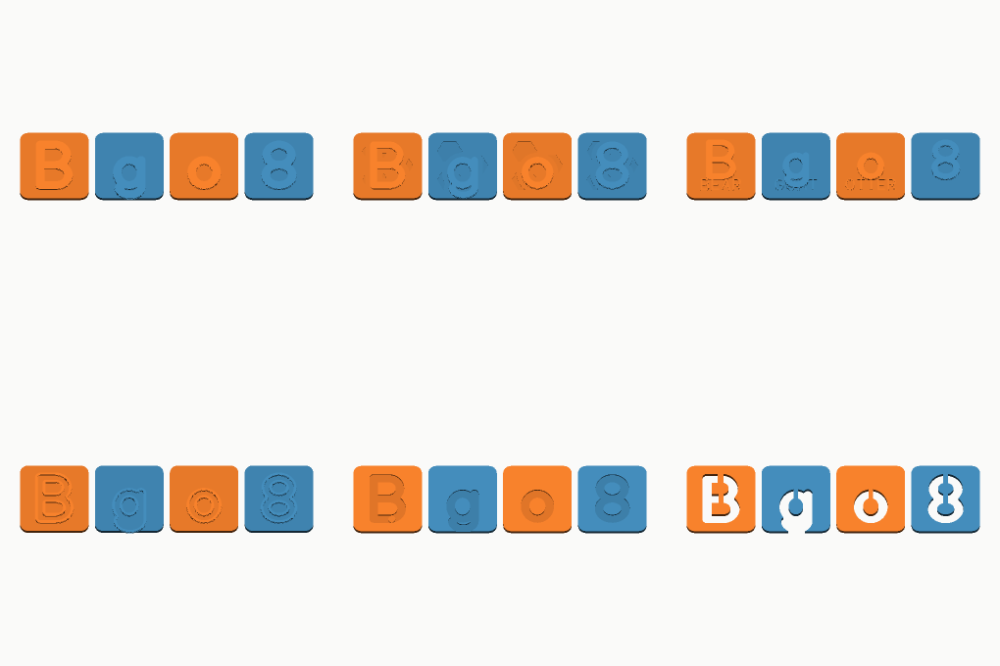
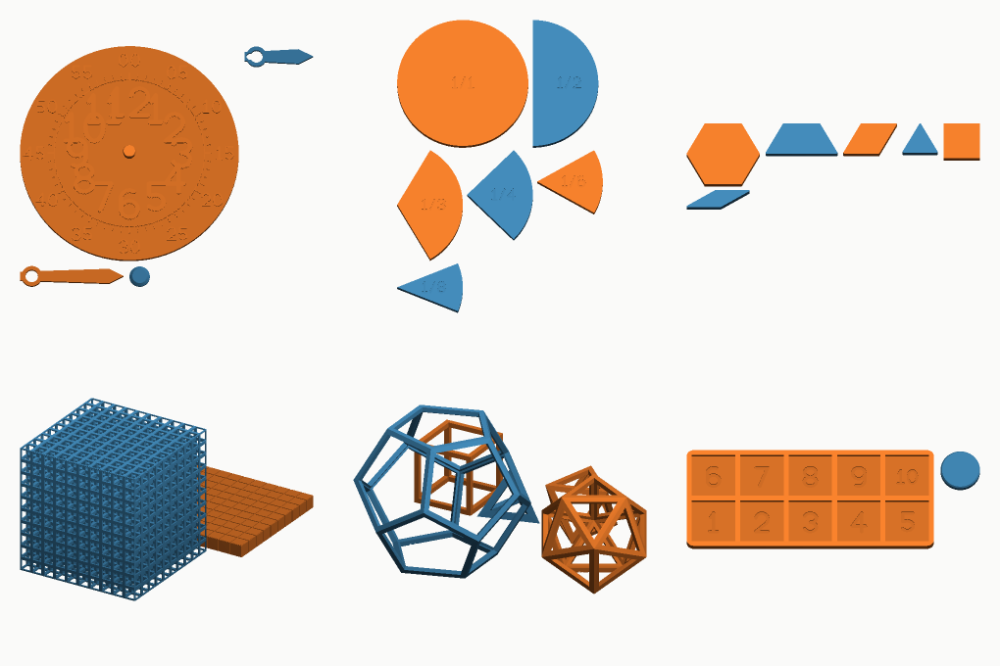
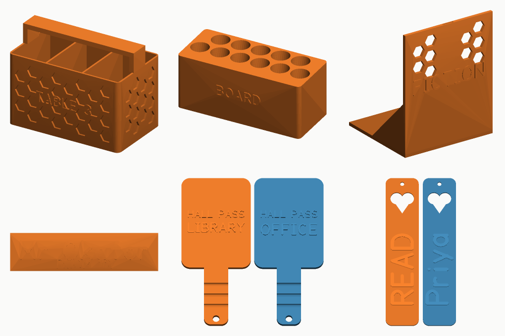
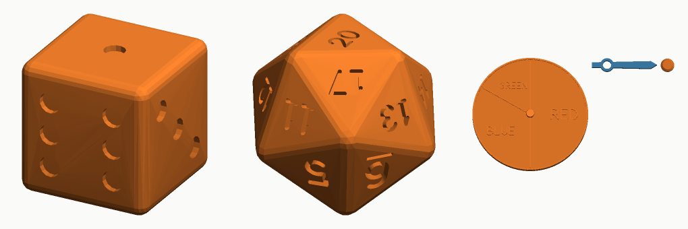

# Teacher Aids

Parametric generators for printable classroom teaching aids. You declare what
you want as options; the program works out the geometry, writes STL and 3MF,
renders a preview, writes the listing copy, and re-reads every file it wrote to
check it.

Sixteen generators across five categories, each category with its own catalogue
and its own workflow, so a run for maths manipulatives never waits on the
alphabet.

```
teachergen letter-tile --charset uppercase --theme animal --tile-size 50
teachergen batch --category math --out out
```



*The six letter-tile themes, top row: blocky, patterned, animal. Bottom row:
outline, tracing, cut-through window. One font, one baseline, one set of
options.*

---

## What it makes

### Letters and literacy — `catalogues/alphabet.json`

| Generator | What it is |
|---|---|
| `letter-tile` | A whole character set as tiles, in six themes: chunky blocks, textured faces, animal tiles, hollow outlines, finger-tracing cards with a raised start dot, and letters cut clean through. Magnet pockets, ring holes, and an orientation bar so `b` and `d` cannot be picked up as each other. |
| `stencil` | Letter, number and word stencils, with the bridges that stop the middle of an `O` falling out worked out from the letter itself. |

### Maths manipulatives — `catalogues/math.json`



| Generator | What it is |
|---|---|
| `fraction-set` | Fraction circles or bars, every family engraved with its own fraction, each cut edge pulled back by one kerf so the printed pieces actually assemble. |
| `place-value` | Base-ten blocks derived from a single unit dimension. The thousand cube prints as an open lattice rather than a kilogram of plastic. Any base from 2 to 12. |
| `pattern-blocks` | The standard six tiling shapes on one shared edge — one inch by default, so a printed set mixes with a bought one. |
| `geometry-solid` | Fourteen solids as blocks, or as open frames where every edge and vertex can be counted, with the face/edge/vertex numbers engraved on the base. |
| `ten-frame` | The two-by-five frame, with counters sized to drop in rather than be aimed, and a heavier wall for a twenty-frame. |
| `clock-face` | A teaching clock: hour numbers inside, minute numbers outside, sixty ticks between, and hands that turn on a printed post with no screw. |

### Classroom organisation — `catalogues/organization.json`



| Generator | What it is |
|---|---|
| `supply-caddy` | Compartment trays sized by what goes in them: give the columns as relative widths and the dividers land where the scissors and glue sticks need them. |
| `marker-rack` | Tilted racks for markers, pens, pencils, brushes or glue sticks, built around a named bore that says how confident its number is. |
| `book-end` | An L-bracket whose foot goes under the books, with a fillable cavity low down for the shelves where that is not enough. |

### Classroom kit — `catalogues/classroom.json`

| Generator | What it is |
|---|---|
| `name-plate` | Desk name plates as a self-standing wedge, a flat plate, or a plate with a slotted base — lettering fitted to a fixed plate so a whole class set is one size. |
| `bookmark` | Thin bookmarks with a name down the length, a shape cut through the top and a hole for a ribbon. |
| `hall-pass` | Paddle passes, big enough to be seen down a corridor and lettered on both faces. |

### Games and probability — `catalogues/games.json`



| Generator | What it is |
|---|---|
| `dice` | Dice in all five Platonic shapes with anything you like on the faces — pips, numbers, letters, arithmetic signs, blanks — engraved so they still roll fairly. |
| `spinner` | Spinners with sectors you size yourself, so red really can be half the circle, and the probability each sector came out at is recorded in the listing. |

---

## Getting started

```bash
pip install -e .          # manifold3d and numpy; nothing else, no OpenSCAD

teachergen categories                  # the five categories and what is in them
teachergen list --category math        # the generators in one of them
teachergen options letter-tile         # every variable of one generator
teachergen glyphs                      # what the font can draw

teachergen letter-tile --charset A-F --theme tracing --tile-size 60 --out out
teachergen batch --category alphabet --out out
teachergen verify out
```

Every run leaves one directory:

```
out/letter-tile_uppercase_animal_50mm/
  tile_A_upper.stl  …  tile_Z_upper.stl     one STL per part
  letter-tile_….3mf                          every part, laid out on the plate
  preview.png                                plan, three-quarter and elevation
  listing.md / listing.json                  what it is, what it teaches, sizes
  manifest.json                              every option and derived dimension
```

---

## How it fits together

**One declaration per generator.** A generator declares its options once, and
that single declaration drives the CLI flags, the validation, the manifest
written next to the models, and the "Options used" table in the listing. Those
four cannot drift apart because there is only one of them.

**The catalogue is the product line.** `catalogues/<category>.json` names the
variants worth building. `items` are one variant each; `sweeps` expand axes into
their combinations, with a `cap` for when that would be more than anyone wants.
Every variant is validated against its generator's own options the moment the
file is read, so a typo in an eighty-entry catalogue fails in a second rather
than in the eightieth build job.

**Nothing claims more than it can show.** The listing quotes only numbers the
geometry was built from. Where a dimension is an estimate rather than a
published figure — a marker's barrel diameter, say — the estimate is labelled as
one and carried into the manifest and the listing.

**Everything written is read back.** `teachergen verify` re-reads the bytes off
disk, welds the STL's unshared corners the way a slicer does, and rebuilds the
topology from scratch: watertight, consistently wound, one connected piece,
volume and size matching what the manifest claims. Deliberately absent: mesh
repair. If something fails here, the geometry is wrong upstream and the fix
belongs there.

See [docs/pipeline.md](docs/pipeline.md) for the whole run in detail,
[docs/adding-a-generator.md](docs/adding-a-generator.md) to add one, and
[docs/font.md](docs/font.md) for the letterforms.

---

## The workflows

One per category, plus CI. Each runs on its own so a category can be rebuilt
and published without touching the others.

| Workflow | Builds |
|---|---|
| `.github/workflows/alphabet.yml` | the alphabet catalogue |
| `.github/workflows/math.yml` | the maths catalogue |
| `.github/workflows/organization.yml` | the organisation catalogue |
| `.github/workflows/classroom.yml` | the classroom kit catalogue |
| `.github/workflows/games.yml` | the games catalogue |
| `.github/workflows/ci.yml` | tests, catalogue validation, one smoke build per category, proof sheets |

Each category workflow takes the same inputs — `limit`, `pick`, `generator`,
`chunk_size`, `publish`, `release_tag` — and hands them to the shared
`build-category.yml`, which plans the catalogue, fans the variants out across
parallel jobs, merges the results, verifies the merged set, writes release
notes from what is actually on disk, and optionally publishes a release.

It refuses to hang a release tag on a run that was narrowed by `limit` or
`generator`: a tag claims to be the whole catalogue.

They also run on a push that touches their own catalogue or any generator, so a
change to `letter-tile` rebuilds the alphabet and nothing else.

---

## Limits, and what to do about them

**A set is one run.** `letter-tile --charset uppercase` builds twenty-six tiles
in a single run: twenty-six STLs and one 3MF with all of them already arranged
on the plate. `--charset both-cases` is fifty-two, which is more than
`max_tiles` allows by default — the run stops, says exactly which characters it
left out, and puts that in the listing's "Check before you print". Raise
`max_tiles` to build the rest. Every generator that can produce an unbounded set
has the same guard: `max_pieces`, `max_cards`, `max_plates`, `max_marks`,
`max_passes`.

**A sweep is a combinatorial explosion by design.** A catalogue sweep can set
`cap`, which takes an evenly spread subset rather than every combination.
`teachergen plan --limit N --pick spread` does the same thing at the command
line, and `--pick first` when you want the first N instead.

**Big parts are warned about, not refused.** A 460 mm stencil strip is a
legitimate thing to want; the run says it will not fit a 220 mm plate and
exports it anyway.

---

## Printing

Everything here prints flat or upright as supplied, with **no supports**. That
is a constraint the geometry is built to, not a hope: pattern cut-outs are
chosen so no cut leaves a surface above it shallower than 45 degrees, marker
bores lean back rather than forward, the thousand cube is a lattice whose
longest unsupported span is one cell, and geometric frames use the polyhedron's
own faces as their outer surfaces.

Raised lettering starts exactly at the plate's top surface, so a colour change
at that height in any slicer gives a two-colour part for the cost of one
filament swap.

**Safety.** Several of these sets have pieces small enough to fit the
small-parts cylinder used in toy safety testing — counters, unit cubes, dice,
fraction pieces. Each run says so in its listing where it applies. They are
choking hazards for children under three.

---

## Development

```bash
make test        # 160 tests
make demo        # build a few models into out/
make proofs      # render every glyph and every pattern, for eyeballing
make batch       # build every catalogue
make verify      # re-read and check everything in out/
```

The tests worth reading are the ones checking things an STL cannot show you:
that ten printed rods really do cover one printed flat, that a counter fits its
cell and would not fit if it were 12% bigger, that six triangles have exactly
the area of one hexagon, that a marker's bore is the barrel plus the clearance
and not the barrel plus a hope, and that no letter in any font weight ever
leaves a stencil counter that would fall out on the bed.
