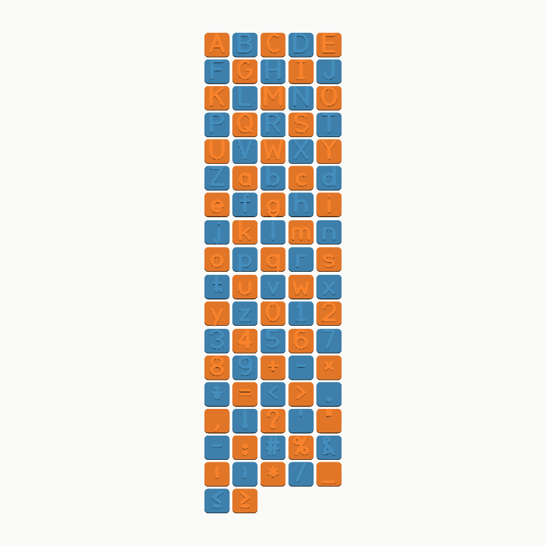

# The font



Eighty-eight glyphs: A–Z, a–z, 0–9, arithmetic signs and punctuation. It is
drawn as a **skeleton**, not as outlines.

## Why a stroke font

A classroom letter is thick, and it is wanted at three different weights for
three different jobs:

| Job | What the letter is |
|---|---|
| a spelling tile | raised 1.6 mm off the face |
| a tracing card | a 2.6 mm groove a fingertip fits in |
| a stencil | cut clean through, with bridges |

An outline font fixes the weight at design time. Storing the skeleton and
inflating it at use means one number — `weight`, given as a fraction of the cap
height — turns a delicate letter into a chunky one, and the same letter can be
raised, recessed or cut without being redrawn.

Inflation is a union of round-capped capsules along each stroke. Not an offset
of the polyline: Clipper's open-path offset is not exposed, and faking one with
an out-and-back polygon encloses zero area, which the fill rule discards.

## Metrics

Everything is drawn on a body 100 units tall and scaled to the caller's cap
height at use.

```
    ascender    100      (b d f h k l, and every capital)
    cap height  100
    x-height     62
    baseline      0
    descender   -24      (g j p q y)
```

Default weight is 18 units — a shade under a fifth of the cap height. Heavy
enough to read across a classroom, light enough that the counters in `B`, `R`
and `8` stay open.

## The glyph format

A glyph is `(advance, strokes)`. A stroke is a list of items, each either a
point `(x, y)` or an arc `("arc", cx, cy, rx, ry, start_deg, end_deg)`.
Consecutive items are joined by straight lines, so a stroke mixes the two
freely.

```python
"A": (70.0, [[(0, 0), (35, 100), (70, 0)], [(10.5, 30), (59.5, 30)]]),
"S": (64.0, [[_arc(32, 75, 32, 25, 38, 270),
              _arc(32, 25, 32, 25, 90, -140)]]),
```

Arcs are **elliptical**, because a capital `O` on this body is 74 wide and 100
tall. Sampling that as a circle would give a short round letter instead of the
intended one.

## Things the font data has to get right

**Single-storey `a` and `g`.** This is a font for someone learning to write, and
the two-storey forms are not the ones they are taught to draw.

**A serifed `I`.** So a capital `I` cannot be read as a lower-case `l`.

**`i` and `j` dots that stay separate.** The dot is a single point and the stem
stops short of the x-height. At the weights a classroom tile uses the pen is
twenty-odd units across, and a dot placed where it looks right at a light weight
welds itself to the stem at a heavy one and the letter reads as an `l`. There is
a test for this at four weights.

**`x` is a letter and `×` is a symbol.** A child sorting tiles needs them to be
different objects, so they are different glyphs.

## Stencils

Cut a letter through a plate and the middle of the `O` falls out. `stencil_cut`
handles that in three steps:

1. **Fill the slivers.** A stroked letter picks up crescents where two strokes
   nearly meet — the half-millimetre gap between the bowl and the tail of a `g`
   is the clearest. They are drawing artefacts, they are too narrow to bridge or
   to get a pencil into, and they print as loose splinters. Filling them leaves
   the letter looking identical.
2. **Bridge the real counters.** Every enclosed hole gets a channel cut from its
   centre straight up and out past the top of the glyph. Upwards, because a
   stroke is thinnest where it is horizontal, so a vertical channel crosses the
   least ink. A channel running from a lower counter into an upper one — the two
   eyes of a `B`, of an `8` — is not a problem: the upper one's channel carries
   on out to the plate and the chain holds.
3. **Fill whatever survives both.** A shape nobody anticipated gets filled
   rather than left to fall out of the print.

What comes back never contains an island. There is a test over every glyph at
three sizes and four weights.

## Words

`font.ANIMALS` pairs each letter with an animal, chosen so the letter is the
word's *initial sound* rather than just its initial spelling — no *Cheetah* for
C, no *Gnu* for G. `X` carries *Fox*, which ends with the sound instead of
starting with it; that is how every alphabet chart handles it, and it is worth
saying out loud to a class rather than glossing over.

## Proofing it

The font is data, and a glyph with a transposed coordinate still builds, still
exports and still passes every topological check. It just looks wrong, and
looking wrong is invisible in a diff.

```bash
python tools/font_sheet.py --out proofs
```

Renders every glyph at four weights. CI runs it on every push and keeps the
sheets as artifacts.
